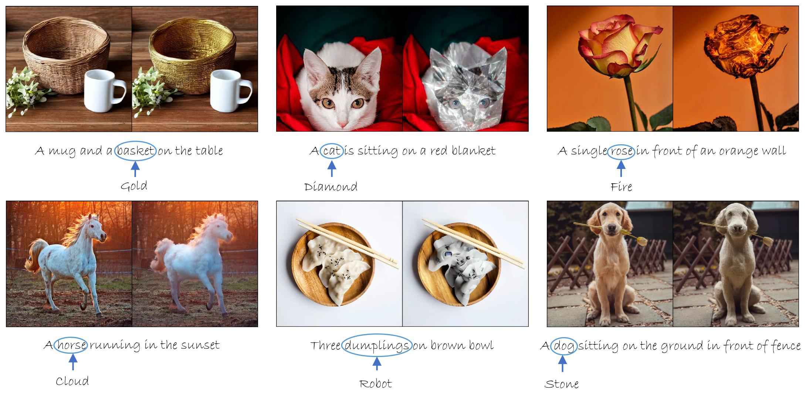
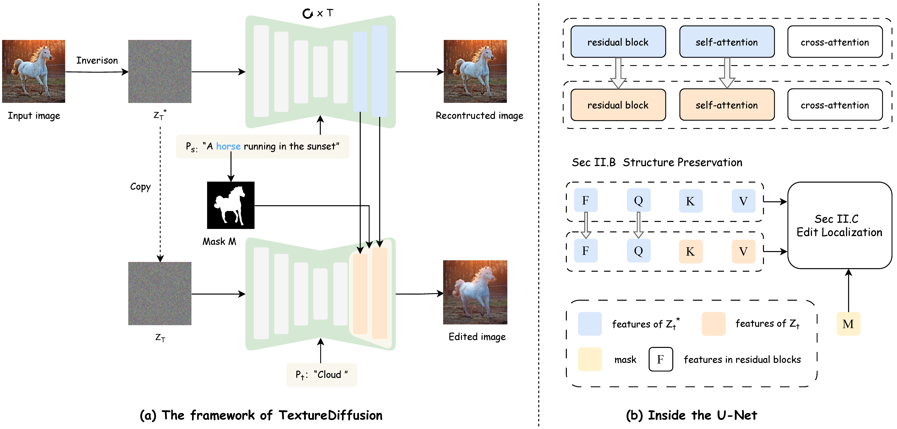
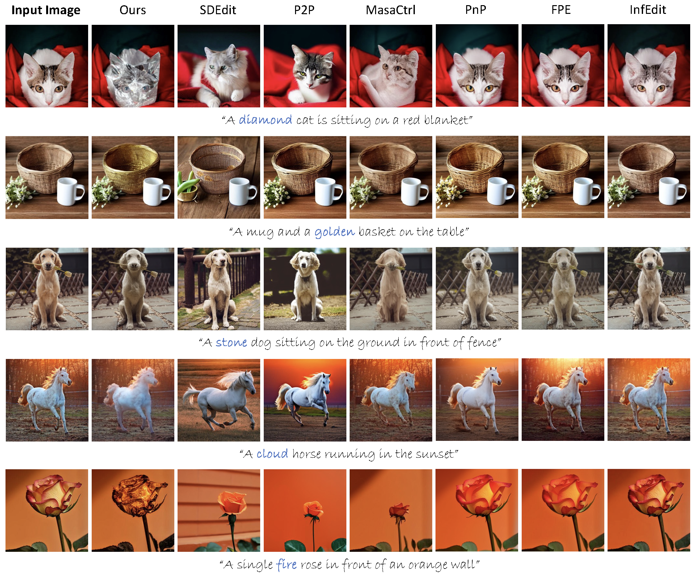
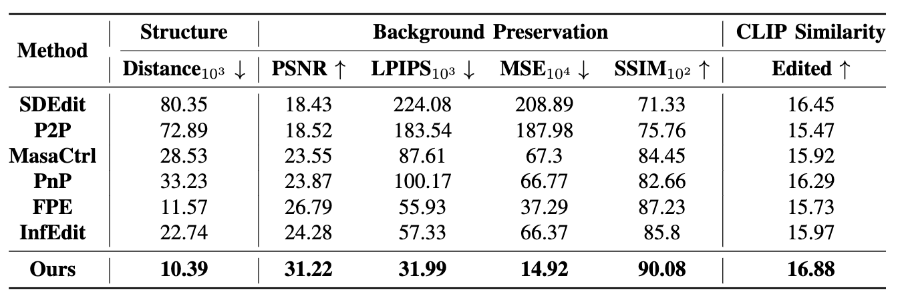

  <h2 align="center"><strong>TextureDiffusion: Target Prompt Disentangled  Editing for Various Texture Transfer</strong></h2>

    <a href="https://github.com/Sugewud">Zihan Su</a>,
    <a href="https://github.com/zhuang2002">Junhao Zhuang</a>,
    <a href="https://github.com/ppcd401d2">Chun Yuan</a>
     
    <b>Tsinghua University</b>

    

## Release
- [09/16] Initial Preview Release 🔥 Coming Soon!

## Contents
- [Release](#release)
- [Contents](#contents)
- [🐶 Introduction](#-introduction)
- [📆 TODO](#-todo)
- [🙌🏻 Acknowledgement](#-acknowledgement)

## 🐶 Introduction
Recently, text-guided image editing has achieved significant success. However, existing methods can only apply simple textures like wood or gold when changing the texture of an object. Complex textures such as cloud or fire pose a challenge. This limitation stems from that the target prompt needs to contain both the input image content and \<texture\>, restricting the texture representation. In this paper, we propose TextureDiffusion, a tuning-free image editing method applied to various texture transfer. 

   

## 📆 TODO
The repo is still being under construction, thanks for your patience. 
- [ ] Release of code.

## 🙌🏻 Acknowledgement
Our code is based on these awesome repos:
* [PnPInversion](https://arxiv.org/abs/2310.01506) [[code](https://github.com/cure-lab/PnPInversion/tree/main)]
* [MasaCtrl](https://arxiv.org/abs/2304.08465) [[code](https://github.com/TencentARC/MasaCtrl)]

